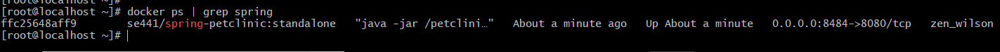
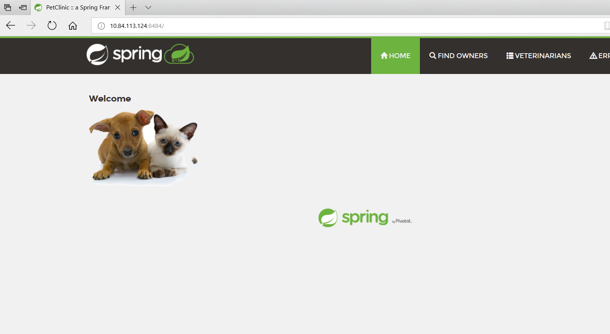
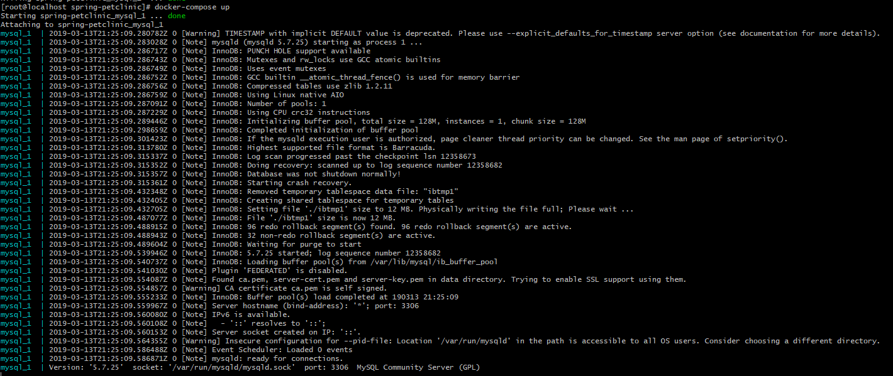
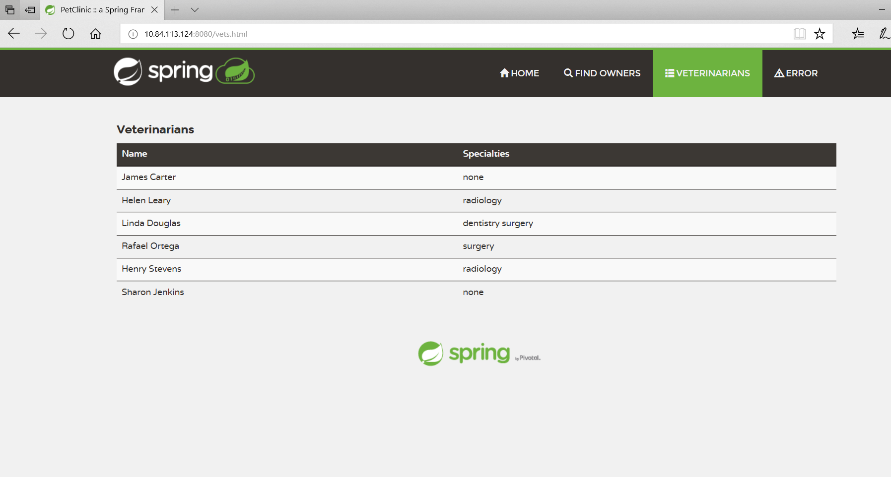
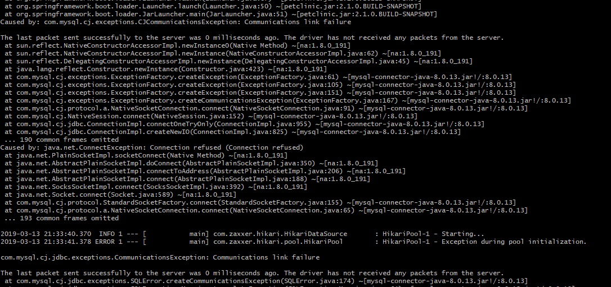

Note: I am using a docker install that I have on a Centos VM that I am using for work, so the address I access in my browser shows as a different host than localhost.

Docker

- Dockerfile: https://github.com/kevin-looft/spring-petclinic/blob/master/Dockerfile

- Out of docker ps command:

- Browser accessing site from container:

Docker Compose - Mysql
- docker-compose up command output

- Browser access Veterinarians page

- Connection Exception stacktrace 

