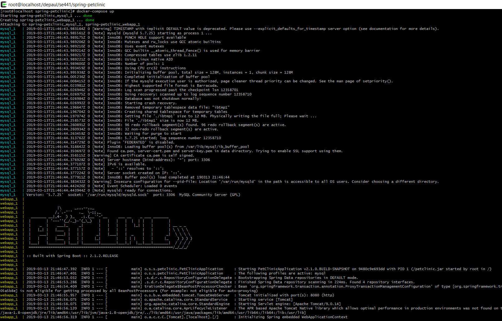
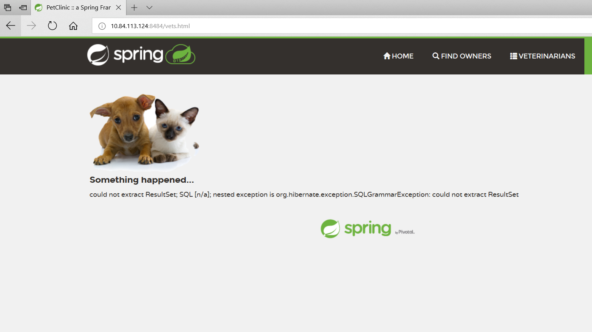

Note: I am using a docker install that I have on a Centos VM that I am using for work, so the address I access in my browser shows as a different host than localhost.

Docker

- Dockerfile: https://github.com/kevin-looft/spring-petclinic/blob/master/Dockerfile

- Out of docker ps command:

- Browser accessing site from container:

Docker Compose - Mysql
- docker-compose up command output

- Browser access Veterinarians page

- Connection Exception stacktrace 

Docker Compose - App server and mysql
- Updated docker-compose file: https://github.com/kevin-looft/spring-petclinic/blob/master/docker-compose.yml

 - Updated application-mysql.properties file: https://github.com/kevin-looft/spring-petclinic/blob/master/src/main/resources/application-mysql.properties
 
 - docker-compose up output
 
 
 - Browser accessing Veterinarians page from docker container
 
 
 **Note, I had to re-enable the spring property to populate the database on each run, otherwise the table was petclinic.vets was not found and I got this error**
 
 
